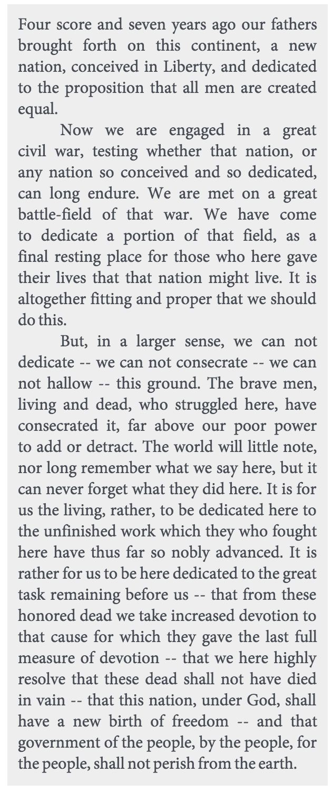

### Introduction

This is a line breaking web service, used for formatting paragraphs of texts
into elegantly typeset blocks. It is specifically targeted at typesetting for
websites, and therefore, ingests and produces html formatted source. The
typesetting code itself, is an implementation of the wonderful Knuth Total Fit
algorithm, which is documented in the book, Digital Typography, by Donald Knuth.

The original intention for this project was to remove heavy lifting typesetting
code from another project that was using it. This was to keep that code, light
weight, and centralize the problem domain. The result is this project, which is
hoped to grow in versatility. Currently, it provides the very basic and
essential functionality of setting text within a square according to a
particular font and size, but the breath of functionality not yet derived is
truly a wide open atmosphere.

### Interface

#### Parameters

    width            - The width, in pixels, of the output text area
    height           - The height, in pixels, of the output text area
    line_height      - The line height
    overflow_reserve - The size of the overflow reserve (see below)
    html             - The html formatted text to be wrapped

#### Example Usage (In Ruby)

    require 'net/http'

    width       = 284
    height      = 720
    line_height = '20px'
    html        = <<-INPUT
      

        Four score and seven years ago our fathers brought forth on this continent, a
        new nation, conceived in Liberty, and dedicated to the proposition that all
        men are created equal.
      

      

        Now we are engaged in a great civil war, testing whether that nation, or any
        nation so conceived and so dedicated, can long endure. We are met on a great
        battle-field of that war. We have come to dedicate a portion of that field, as a
        final resting place for those who here gave their lives that that nation might
        live. It is altogether fitting and proper that we should do this.
      

      

        But, in a larger sense, we can not dedicate -- we can not consecrate -- we can
        not hallow -- this ground. The brave men, living and dead, who struggled here,
        have consecrated it, far above our poor power to add or detract. The world will
        little note, nor long remember what we say here, but it can never forget what
        they did here. It is for us the living, rather, to be dedicated here to the
        unfinished work which they who fought here have thus far so nobly advanced. It
        is rather for us to be here dedicated to the great task remaining before us --
        that from these honored dead we take increased devotion to that cause for which
        they gave the last full measure of devotion -- that we here highly resolve that
        these dead shall not have died in vain -- that this nation, under God, shall
        have a new birth of freedom -- and that government of the people, by the people,
        for the people, shall not perish from the earth.
      

    INPUT

    response = Net::HTTP.post_form(LINEBREAK_SERVICE_URI, {
      "width" => width,
      "height" => height,
      "line_height" => line_height,
      "html" => html
    })

    parsed_response = JSON.parse(response.body)["html"]
    typeset_html    = parsed_response["html"]

    puts typeset_html # => (Output formatted for easy reading)
    # 

    #   Four score and seven years ago our fathers
    #   brought forth on this continent, a new
    #   nation, conceived in Liberty, and dedicated
    #   to the proposition that all men are created
    #   equal. &nbsp;&nbsp;&nbsp;&nbsp;&nbsp;&nbsp;&nbsp;&nbsp;
    # 

    # 

    #   Now we are engaged in a great
    #   civil war, testing whether that nation, or
    #   any nation so conceived and so dedicated,
    #   can long endure. We are met on a great
    #   battle-field of that war. We have come
    #   to dedicate a portion of that field, as a
    #   final resting place for those who here gave
    #   their lives that that nation might live. It is
    #   altogether fitting and proper that we should
    #   do this. &nbsp;&nbsp;&nbsp;&nbsp;&nbsp;&nbsp;
    # 

    # 

    #   But, in a larger sense, we can not
    #   dedicate -- we can not consecrate -- we can
    #   not hallow -- this ground. The brave men,
    #   living and dead, who struggled here, have
    #   consecrated it, far above our poor power
    #   to add or detract. The world will little note,
    #   nor long remember what we say here, but it
    #   can never forget what they did here. It is for
    #   us the living, rather, to be dedicated here to
    #   the unfinished work which they who fought
    #   here have thus far so nobly advanced. It is
    #   rather for us to be here dedicated to the great
    #   task remaining before us -- that from these
    #   honored dead we take increased devotion to
    #   that cause for which they gave the last full
    #   measure of devotion -- that we here highly
    #   resolve that these dead shall not have died
    #   in vain -- that this nation, under God, shall
    #   have a new birth of freedom -- and that
    #   government of the people, by the people, for
    #   the people, shall not perish from the earth. 
    # 

See [[examples/gettysburg_address.html]] for styles.

#### Overflow Reserve and Continuations

The interface accepts an additional parameter called overflow_reserve. This
specifies a height that is to be reserved at the bottom of the prescribed text
area. This is used in the case of an overflow, where there is not enough room to
fit all the text within the output region. In this case, The height of the
requested overflow reserve will be accounted for, so that a link, for example
could be placed there, and the excess output is returned int the overflow_html
attributed. The overflow_html can be processed in a subsequent request, in
effect to string text areas together.

#### Overflow Reserve Example

    require 'net/http'

    width            = 284
    height           = 200
    line_height      = '20px'
    overflow_reserve = '20px'
    html             = <<-PETERPAN
      
He tried to argue with Tink. "You know you can't be my fairy, Tink, because I
      am an gentleman and you are a lady."

      
To this Tink replied in these words, "You silly ass," and disappeared into
      the bathroom. "She is quite a common fairy," Peter explained apologetically,
      "she is called Tinker Bell because she mends the pots and kettles [tinker = tin
      worker]." [Similar to "cinder" plus "elle" to get Cinderella]

      
They were together in the armchair by this time, and Wendy plied him with
      more questions.

      
"If you don't live in Kensington Gardens now—"

      
"Sometimes I do still."

      
"But where do you live mostly now?"

      
"With the lost boys."

      
"Who are they?"

      
"They are the children who fall out of their perambulators when the nurse is
      looking the other way. If they are not claimed in seven days they are sent far
      away to the Neverland to defray expenses. I'm captain."

      
"What fun it must be!"

      
"Yes," said cunning Peter, "but we are rather lonely. You see we have no
      female companionship."

      
"Are none of the others girls?"

      
"Oh, no; girls, you know, are much too clever to fall out of their
      prams."

      
This flattered Wendy immensely. "I think," she said, "it is perfectly lovely
      the way you talk about girls; John there just despises us."

      
For reply Peter rose and kicked John out of bed, blankets and all; one kick.
      This seemed to Wendy rather forward for a first meeting, and she told him with
      spirit that he was not captain in her house. However, John continued to sleep so
      placidly on the floor that she allowed him to remain there. "And I know you
      meant to be kind," she said, relenting, "so you may give me a kiss."

      
For the moment she had forgotten his ignorance about kisses. "I thought you
      would want it back," he said a little bitterly, and offered to return her the
      thimble.

      
"Oh dear," said the nice Wendy, "I don't mean a kiss, I mean a thimble."

      
"What's that?"

      
"It's like this." She kissed him.

    PETERPAN

    response = Net::HTTP.post_form(LINEBREAK_SERVICE_URI, {
      "width" => width,
      "height" => height,
      "line_height" => line_height,
      "overflow_reserve" => overflow_reserve,
      "html" => html
    })

    parsed_response = JSON.parse(response.body)["html"]
    typeset_html    = parsed_response["html"]
    overflow_html    = parsed_response["overflow_html"]

    puts typeset_html # => (formatted for easy reading)
    # 

    #   He tried to argue with Tink. "You
    #   know you can't be my fairy, Tink, because
    #   I am an gentleman and you are a lady." 
    # 

    # 

    #   To this Tink replied in these words,
    #   "You silly ass," and disappeared into the
    #   bathroom. "She is quite a common fairy,"
    #   Peter explained apologetically, "she is called
    #   Tinker Bell because she mends the pots and
    #   kettles [tinker = tin worker]." [Similar to
    # 

    puts overflow_html # =>
    # 
"cinder" plus "elle" to get Cinderella]

    # 
They were together in the armchair by this time, and Wendy plied him with more questions.

    # 
"If you don't live in Kensington Gardens now—"

    # 
"Sometimes I do still."

    # 
"But where do you live mostly now?"

    # 
"With the lost boys."

    # 
"Who are they?"

    # 
"They are the children who fall out of their perambulators when the nurse is
    #   looking the other way. If they are not claimed in seven days they are sent far
    #   away to the Neverland to defray expenses. I'm captain."

    # 
"What fun it must be!"

    # 
"Yes," said cunning Peter, "but we are rather lonely. You see we have no
    #   female companionship."

    # 
"Are none of the others girls?"

    # 
"Oh, no; girls, you know, are much too clever to fall out of their
    #   prams."

    # 
This flattered Wendy immensely. "I think," she said, "it is perfectly lovely
    #   the way you talk about girls; John there just despises us."

    # 
For reply Peter rose and kicked John out of bed, blankets and all; one kick.
    #   This seemed to Wendy rather forward for a first meeting, and she told him with
    #   spirit that he was not captain in her house. However, John continued to sleep so
    #   placidly on the floor that she allowed him to remain there. "And I know you
    #   meant to be kind," she said, relenting, "so you may give me a kiss."

    # 
For the moment she had forgotten his ignorance about kisses. "I thought you
    #   would want it back," he said a little bitterly, and offered to return her the
    #   thimble.

    # 
"Oh dear," said the nice Wendy, "I don't mean a kiss, I mean a thimble."

    # 
"What's that?"

    # 
"It's like this." She kissed him.

#### HTML Links

It is possible to include standard html links in the text, and the will be
handled appropriately, and hyphenated where need be. When a link is broken over a
line, two links are generated, both pointing to the same resource, one at the
end of the first line, and the other at the beginning of the next.

### Installation

Note: You need a functional installation of Ruby, version 2.

To install the line break service, clone the source down to your local disk.

    git clone https://github.com/newstime/line_breaking_service.git

Run bundle install from the project root.

    cd line_breaking_service
    bundle install

Start the web service in one of two ways. Either use the wake_giant script in
the script directory, which will create unix socket which requests can be piped
to, for example, from NGINX.

    bundle exec script/wake_giant

Or, start the service using foreman. In this example, the service will be
available on port 9000.

    foreman start -p 9000

### Credits

This project would not have been possible without so many people, it is
impossible to thank them all here. Special thanks certainly goes to Donald
Knuth, for his book Digital Typography, and his line breaking algorithms. Thanks
also goes to Brad Ediger for his implementation of the Knuth-Plass algorithm in
the Crawdad gem. And certainly, thanks be to God, for giving us the Grace to
make things like this work. God bless.
